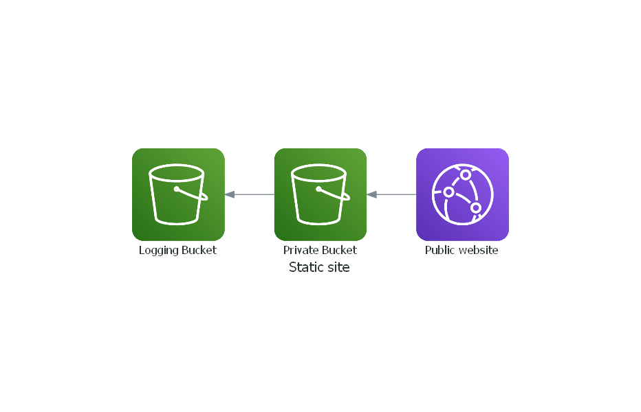

# terraform-aws-cloudfront-s3

[](https://github.com/JamesWoolfenden/terraform-aws-cloudfront-s3)
[](https://github.com/JamesWoolfenden/terraform-aws-cloudfront-s3/releases/latest)
[](https://github.com/JamesWoolfenden/terraform-aws-cloudfront-s3/releases/latest)

[](https://github.com/pre-commit/pre-commit)
[](https://www.checkov.io/)


This Terraform module is to provision a private S3 bucket, and use it as a static website, and sit that behind a Cloudfront distribution.
Certificate needs a delay adding before cloudfront uses it, until then run it twice.

## Usage

Creates a static site with cloudfront distribution in front.



To use, add **module.cloudfront.tf** to your template and update your variables and values, see _example/examplea_ for a full worked example.

```hcl
module "cloudfront" {
  source       = "JamesWoolfenden/cloudfront-s3/aws"
  version      = "0.3.2"
  common_tags = var.common_tags
  bucket_name = var.bucket_name
}
```

The default TTL values have been set very low, you will override these (but oh so helpful for development), for a more effective cache.

<!-- BEGINNING OF PRE-COMMIT-TERRAFORM DOCS HOOK -->
## Requirements

| Name | Version |
| ---- | ------- |
| <a name="requirement_terraform"></a> [terraform](#requirement\_terraform) | >=0.14.8 |
| <a name="requirement_aws"></a> [aws](#requirement\_aws) | 6.43.0 |

## Providers

| Name | Version |
| ---- | ------- |
| <a name="provider_aws"></a> [aws](#provider\_aws) | 6.43.0 |
| <a name="provider_aws.useastone"></a> [aws.useastone](#provider\_aws.useastone) | 6.43.0 |

## Modules

No modules.

## Resources

| Name | Type |
| ---- | ---- |
| [aws_acm_certificate.cert](https://registry.terraform.io/providers/hashicorp/aws/6.43.0/docs/resources/acm_certificate) | resource |
| [aws_acm_certificate_validation.cert](https://registry.terraform.io/providers/hashicorp/aws/6.43.0/docs/resources/acm_certificate_validation) | resource |
| [aws_cloudfront_distribution.website](https://registry.terraform.io/providers/hashicorp/aws/6.43.0/docs/resources/cloudfront_distribution) | resource |
| [aws_cloudfront_origin_access_identity.website](https://registry.terraform.io/providers/hashicorp/aws/6.43.0/docs/resources/cloudfront_origin_access_identity) | resource |
| [aws_cloudfront_response_headers_policy.pass](https://registry.terraform.io/providers/hashicorp/aws/6.43.0/docs/resources/cloudfront_response_headers_policy) | resource |
| [aws_route53_record.cert_validation](https://registry.terraform.io/providers/hashicorp/aws/6.43.0/docs/resources/route53_record) | resource |
| [aws_route53_record.cloudfront](https://registry.terraform.io/providers/hashicorp/aws/6.43.0/docs/resources/route53_record) | resource |
| [aws_s3_bucket.logging](https://registry.terraform.io/providers/hashicorp/aws/6.43.0/docs/resources/s3_bucket) | resource |
| [aws_s3_bucket.website](https://registry.terraform.io/providers/hashicorp/aws/6.43.0/docs/resources/s3_bucket) | resource |
| [aws_s3_bucket_acl.logging](https://registry.terraform.io/providers/hashicorp/aws/6.43.0/docs/resources/s3_bucket_acl) | resource |
| [aws_s3_bucket_acl.website](https://registry.terraform.io/providers/hashicorp/aws/6.43.0/docs/resources/s3_bucket_acl) | resource |
| [aws_s3_bucket_cors_configuration.website](https://registry.terraform.io/providers/hashicorp/aws/6.43.0/docs/resources/s3_bucket_cors_configuration) | resource |
| [aws_s3_bucket_lifecycle_configuration.logging](https://registry.terraform.io/providers/hashicorp/aws/6.43.0/docs/resources/s3_bucket_lifecycle_configuration) | resource |
| [aws_s3_bucket_logging.website](https://registry.terraform.io/providers/hashicorp/aws/6.43.0/docs/resources/s3_bucket_logging) | resource |
| [aws_s3_bucket_policy.cloudfront](https://registry.terraform.io/providers/hashicorp/aws/6.43.0/docs/resources/s3_bucket_policy) | resource |
| [aws_s3_bucket_public_access_block.logging](https://registry.terraform.io/providers/hashicorp/aws/6.43.0/docs/resources/s3_bucket_public_access_block) | resource |
| [aws_s3_bucket_server_side_encryption_configuration.logging](https://registry.terraform.io/providers/hashicorp/aws/6.43.0/docs/resources/s3_bucket_server_side_encryption_configuration) | resource |
| [aws_s3_bucket_versioning.logging](https://registry.terraform.io/providers/hashicorp/aws/6.43.0/docs/resources/s3_bucket_versioning) | resource |
| [aws_s3_bucket_versioning.website](https://registry.terraform.io/providers/hashicorp/aws/6.43.0/docs/resources/s3_bucket_versioning) | resource |
| [aws_s3_bucket_website_configuration.website](https://registry.terraform.io/providers/hashicorp/aws/6.43.0/docs/resources/s3_bucket_website_configuration) | resource |
| [aws_s3_object.index](https://registry.terraform.io/providers/hashicorp/aws/6.43.0/docs/resources/s3_object) | resource |
| [aws_iam_policy_document.cloudfront](https://registry.terraform.io/providers/hashicorp/aws/6.43.0/docs/data-sources/iam_policy_document) | data source |
| [aws_route53_zone.selected](https://registry.terraform.io/providers/hashicorp/aws/6.43.0/docs/data-sources/route53_zone) | data source |

## Inputs

| Name | Description | Type | Default | Required |
| ---- | ----------- | ---- | ------- | :------: |
| <a name="input_access_log_bucket"></a> [access\_log\_bucket](#input\_access\_log\_bucket) | Name of your access logging bucket | `string` | `"logging"` | no |
| <a name="input_acm_certificate_arn"></a> [acm\_certificate\_arn](#input\_acm\_certificate\_arn) | The ARN of the certificate to be used | `string` | `""` | no |
| <a name="input_bucket_acl"></a> [bucket\_acl](#input\_bucket\_acl) | n/a | `string` | `"Private"` | no |
| <a name="input_bucket_name"></a> [bucket\_name](#input\_bucket\_name) | name of the bucket | `string` | n/a | yes |
| <a name="input_cloudfront_default_certificate"></a> [cloudfront\_default\_certificate](#input\_cloudfront\_default\_certificate) | use default SSL certificate | `bool` | `false` | no |
| <a name="input_common_tags"></a> [common\_tags](#input\_common\_tags) | Implements the common tags scheme | `map(any)` | n/a | yes |
| <a name="input_default_ttl"></a> [default\_ttl](#input\_default\_ttl) | default ttl values | `number` | `90` | no |
| <a name="input_force_destroy"></a> [force\_destroy](#input\_force\_destroy) | n/a | `bool` | `true` | no |
| <a name="input_fqdn"></a> [fqdn](#input\_fqdn) | The fully qualified domain Name | `string` | n/a | yes |
| <a name="input_header_policy_name"></a> [header\_policy\_name](#input\_header\_policy\_name) | n/a | `string` | n/a | yes |
| <a name="input_kms_key"></a> [kms\_key](#input\_kms\_key) | n/a | `any` | n/a | yes |
| <a name="input_locations"></a> [locations](#input\_locations) | Locations for the Distribution | `list(any)` | <pre>[<br/>  "GB"<br/>]</pre> | no |
| <a name="input_max_ttl"></a> [max\_ttl](#input\_max\_ttl) | max ttl values | `number` | `300` | no |
| <a name="input_min_ttl"></a> [min\_ttl](#input\_min\_ttl) | min ttl values | `number` | `30` | no |
| <a name="input_price_class"></a> [price\_class](#input\_price\_class) | n/a | `string` | `"PriceClass_100"` | no |
| <a name="input_restriction_type"></a> [restriction\_type](#input\_restriction\_type) | n/a | `string` | `"whitelist"` | no |
| <a name="input_retain"></a> [retain](#input\_retain) | Do you want to retain the distribution on delete? | `bool` | `false` | no |
| <a name="input_sse_algorithm"></a> [sse\_algorithm](#input\_sse\_algorithm) | The type of encryption algorithm to use | `string` | `"aws:kms"` | no |
| <a name="input_ttl"></a> [ttl](#input\_ttl) | n/a | `string` | `"300"` | no |
| <a name="input_versioning"></a> [versioning](#input\_versioning) | Switch to control versioning | `string` | `"Enabled"` | no |
| <a name="input_web_acl_id"></a> [web\_acl\_id](#input\_web\_acl\_id) | The id of the WAF | `string` | n/a | yes |
| <a name="input_zone"></a> [zone](#input\_zone) | The route53 zone to use | `string` | n/a | yes |

## Outputs

| Name | Description |
| ---- | ----------- |
| <a name="output_distribution"></a> [distribution](#output\_distribution) | n/a |
| <a name="output_identity"></a> [identity](#output\_identity) | n/a |
| <a name="output_logging"></a> [logging](#output\_logging) | n/a |
| <a name="output_policy"></a> [policy](#output\_policy) | n/a |
| <a name="output_website"></a> [website](#output\_website) | n/a |
<!-- END OF PRE-COMMIT-TERRAFORM DOCS HOOK -->

## Policy

<!-- BEGINNING OF PRE-COMMIT-PIKE DOCS HOOK -->
The Terraform resource required is:

```golang
resource "aws_iam_policy" "terraform_pike" {
  name_prefix = "terraform_pike"
  path        = "/"
  description = "Pike Autogenerated policy from IAC"

  policy = jsonencode({
    "Version": "2012-10-17",
    "Statement": [
        {
            "Sid": "VisualEditor0",
            "Effect": "Allow",
            "Action": [
                "acm:AddTagsToCertificate",
                "acm:DeleteCertificate",
                "acm:DescribeCertificate",
                "acm:GetCertificate",
                "acm:ListTagsForCertificate",
                "acm:RemoveTagsFromCertificate",
                "acm:RequestCertificate"
            ],
            "Resource": [
                "*"
            ]
        },
        {
            "Sid": "VisualEditor1",
            "Effect": "Allow",
            "Action": [
                "cloudfront:CreateCloudFrontOriginAccessIdentity",
                "cloudfront:CreateDistribution",
                "cloudfront:CreateDistributionWithTags",
                "cloudfront:CreateResponseHeadersPolicy",
                "cloudfront:DeleteCloudFrontOriginAccessIdentity",
                "cloudfront:DeleteDistribution",
                "cloudfront:DeleteResponseHeadersPolicy",
                "cloudfront:GetCloudFrontOriginAccessIdentity",
                "cloudfront:GetDistribution",
                "cloudfront:GetDistributionConfig",
                "cloudfront:GetResponseHeadersPolicy",
                "cloudfront:ListTagsForResource",
                "cloudfront:TagResource",
                "cloudfront:UntagResource",
                "cloudfront:UpdateDistribution",
                "cloudfront:UpdateDistributionWithStagingConfig",
                "cloudfront:UpdateResponseHeadersPolicy"
            ],
            "Resource": [
                "*"
            ]
        },
        {
            "Sid": "VisualEditor2",
            "Effect": "Allow",
            "Action": [
                "ec2:DescribeAccountAttributes"
            ],
            "Resource": [
                "*"
            ]
        },
        {
            "Sid": "VisualEditor3",
            "Effect": "Allow",
            "Action": [
                "route53:ChangeResourceRecordSets",
                "route53:GetChange",
                "route53:GetHostedZone",
                "route53:ListHostedZones",
                "route53:ListResourceRecordSets",
                "route53:ListTagsForResource"
            ],
            "Resource": [
                "*"
            ]
        },
        {
            "Sid": "VisualEditor4",
            "Effect": "Allow",
            "Action": [
                "s3:CreateBucket",
                "s3:DeleteBucket",
                "s3:DeleteBucketPolicy",
                "s3:DeleteBucketWebsite",
                "s3:DeleteObject",
                "s3:GetAccelerateConfiguration",
                "s3:GetBucketAcl",
                "s3:GetBucketCORS",
                "s3:GetBucketLocation",
                "s3:GetBucketLogging",
                "s3:GetBucketObjectLockConfiguration",
                "s3:GetBucketPolicy",
                "s3:GetBucketPublicAccessBlock",
                "s3:GetBucketRequestPayment",
                "s3:GetBucketTagging",
                "s3:GetBucketVersioning",
                "s3:GetBucketWebsite",
                "s3:GetEncryptionConfiguration",
                "s3:GetLifecycleConfiguration",
                "s3:GetObject",
                "s3:GetObjectAcl",
                "s3:GetObjectTagging",
                "s3:GetReplicationConfiguration",
                "s3:ListAllMyBuckets",
                "s3:ListBucket",
                "s3:PutBucketAcl",
                "s3:PutBucketCORS",
                "s3:PutBucketLogging",
                "s3:PutBucketPolicy",
                "s3:PutBucketPublicAccessBlock",
                "s3:PutBucketTagging",
                "s3:PutBucketVersioning",
                "s3:PutBucketWebsite",
                "s3:PutEncryptionConfiguration",
                "s3:PutLifecycleConfiguration",
                "s3:PutObject"
            ],
            "Resource": [
                "*"
            ]
        }
    ]
})
}


```
<!-- END OF PRE-COMMIT-PIKE DOCS HOOK -->

## Checkov Exclusion

I have added:

```checkov
  #checkov:skip=CKV_AWS_52: "Ensure S3 bucket has MFA delete enabled"
  #checkov:skip=CKV_AWS_19: "Ensure all data stored in the S3 bucket is securely encrypted at rest"
```

As we will want to deploy to this bucket and it needs to be readable to the world if it's a website.
There are also some exceptions on the logging bucket, e.g. logging of the logging bucket.

## new checks

Address
<https://github.com/bridgecrewio/checkov/issues/146>

## Related Projects

Check out these related projects.

- [terraform-aws-s3](https://github.com/jameswoolfenden/terraform-aws-s3) - S3 buckets

## Help

**Got a question?**

File a GitHub [issue](https://github.com/JamesWoolfenden/terraform-aws-cloudfront-s3/issues).

## Contributing

### Bug Reports & Feature Requests

Please use the [issue tracker](https://github.com/JamesWoolfenden/terraform-aws-cloudfront-s3/issues) to report any bugs or file feature requests.

## Copyrights

Copyright © 2019-2022 James Woolfenden

## License

[](https://opensource.org/licenses/Apache-2.0)

See [LICENSE](LICENSE) for full details.

Licensed to the Apache Software Foundation (ASF) under one
or more contributor license agreements. See the NOTICE file
distributed with this work for additional information
regarding copyright ownership. The ASF licenses this file
to you under the Apache License, Version 2.0 (the
"License"); you may not use this file except in compliance
with the License. You may obtain a copy of the License at

<https://www.apache.org/licenses/LICENSE-2.0>

Unless required by applicable law or agreed to in writing,
software distributed under the License is distributed on an
"AS IS" BASIS, WITHOUT WARRANTIES OR CONDITIONS OF ANY
KIND, either express or implied. See the License for the
specific language governing permissions and limitations
under the License.

### Contributors

[![James Woolfenden][jameswoolfenden_avatar]][jameswoolfenden_homepage]<br/>[James Woolfenden][jameswoolfenden_homepage]

[jameswoolfenden_homepage]: https://github.com/jameswoolfenden
[jameswoolfenden_avatar]: https://github.com/jameswoolfenden.png?size=150
